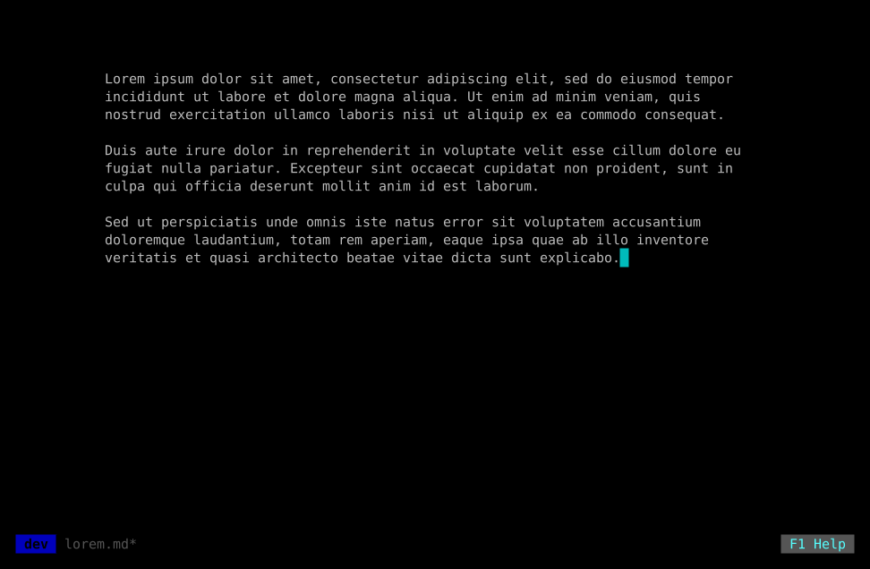
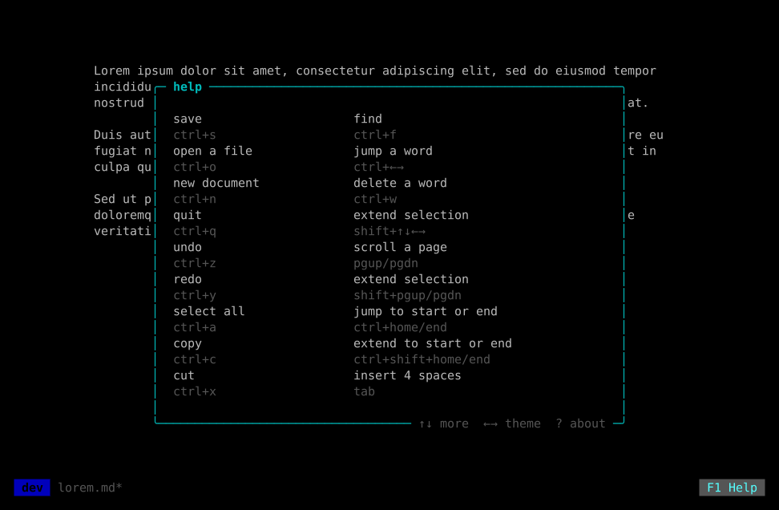
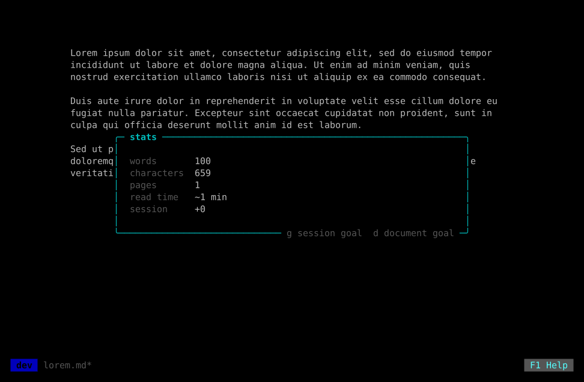
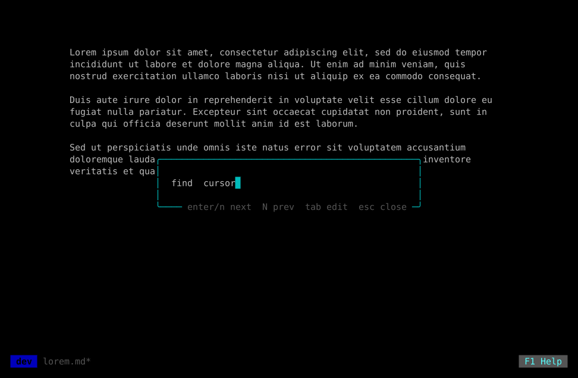
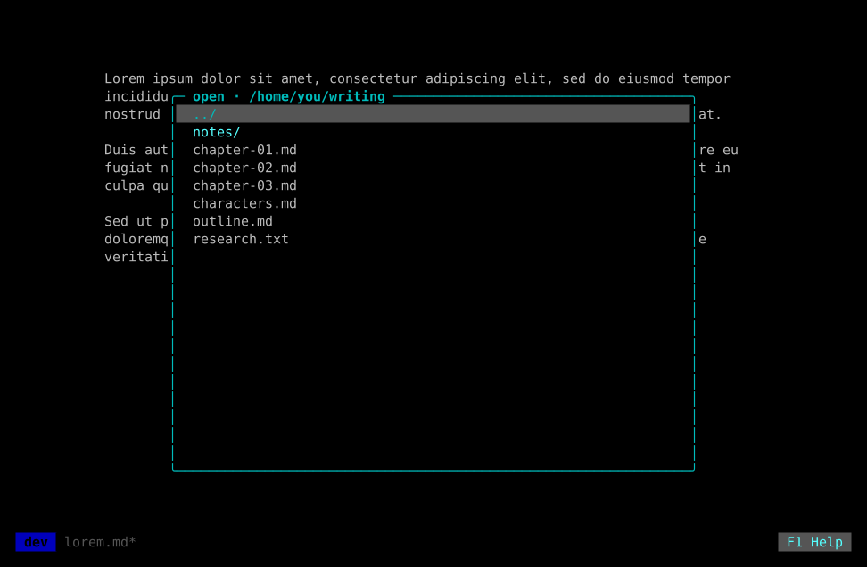
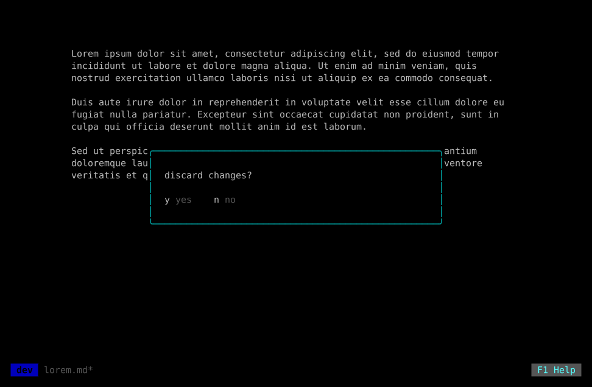
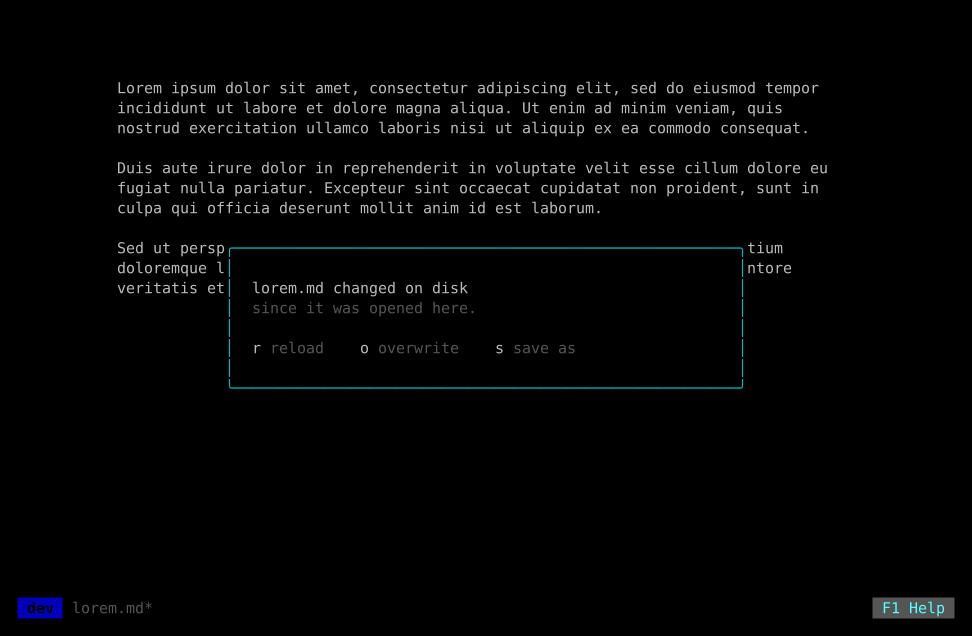

<div align="center">

# justwrite

A distraction-free terminal text editor. Black screen, a centered page, and one line at the foot that tells you where you are.

[](https://github.com/MawCeron/justwrite/blob/main/LICENSE)




</div>

## What is this?

A text editor for writing prose, not code. There are no toolbars, no menus, no
line numbers and no frame around the page — just text, centered, never wider
than 82 columns because lines longer than that are hard to track back to.

Everything the editor knows about itself lives in a single line at the bottom:
the version, the document, and the way into the help. Every action is a keyboard
shortcut; you learn them once and they disappear.

It is one static binary with no cgo and no display server, so it runs anywhere
you can open a terminal — including a headless writerdeck.

## Install

Packages and binaries for Linux, macOS and Windows are on the
[releases page](https://github.com/MawCeron/justwrite/releases), for both x86-64
and ARM. Swap `amd64` for `arm64` below on a Raspberry Pi or an Apple Silicon
Mac.

Debian, Ubuntu:

```bash
sudo dpkg -i justwrite_*_linux_amd64.deb
```

Fedora, RHEL, openSUSE:

```bash
sudo rpm -i justwrite_*_linux_amd64.rpm
```

Anywhere else, unpack the archive and put the binary on your `$PATH`:

```bash
tar xzf justwrite_*_linux_amd64.tar.gz
sudo install justwrite /usr/local/bin/
```

With Go, from source:

```bash
go install github.com/MawCeron/justwrite@latest
```

Or from a clone:

```bash
git clone https://github.com/MawCeron/justwrite
cd justwrite
go build .
```

To build for a writing device you are not on, such as an ARM writerdeck:

```bash
GOOS=linux GOARCH=arm64 go build .
```

## Usage

```bash
justwrite              # a new document
justwrite draft.md     # open a file, or start one under that name
```

Naming a file that does not exist yet is how you start one: the name sticks, and
`Ctrl+S` saves straight to it.

## Keyboard shortcuts

| Shortcut | Action |
|---|---|
| `Ctrl+S` | Save |
| `Ctrl+O` | Open file |
| `Ctrl+N` | New document |
| `Ctrl+Q` | Quit |
| `Ctrl+Z` / `Ctrl+Y` | Undo / redo |
| `Ctrl+A` | Select all |
| `Ctrl+C` / `Ctrl+X` / `Ctrl+V` | Copy / cut / paste |
| `Ctrl+T` | Stats — words, characters, pages, read time |
| `Ctrl+F` | Find. `Enter`/`n` next match, `Shift+N` previous, `Tab` edits the query again, `Esc` closes |
| `F1` | Help |
| `?` | About, from inside the help. Anywhere else it types a `?` |
| `Ctrl+←/→` | Jump a word left or right |
| `Ctrl+W` | Delete the word before the cursor |
| `Shift+arrows` | Extend the selection |
| `Page Up/Down` | Scroll by page |
| `Shift+Page Up/Down` | Extend the selection |
| `Ctrl+Home/End` | Jump to the start or end of the document |
| `Ctrl+Shift+Home/End` | Extend the selection to the start or end |
| `Tab` | Insert 4 spaces |
| `Esc` | Close panel / cancel |

Undo works in bursts: one `Ctrl+Z` takes back a word, not a letter.

`F1` puts the whole list on screen, and `?` from there opens About:



`Ctrl+T` counts what you have written so far. `g` sets a goal for the
session, `d` for the whole document; either shows as `current / goal` once set:



`Ctrl+F` finds text, case-insensitively and wrapping around the document:



### In the file dialogs

| Shortcut | Action |
|---|---|
| type | Filter the listing |
| `Ctrl+H` | Show hidden and binary files |
| `Tab` | Switch between the listing and the filename field |
| `Enter` | Enter a directory, or open the file |
| `Esc` | Clear the filter, then close |



Binary files and dotfiles stay out of the listing by default. Stepping up to the
parent leaves the cursor on the directory you came out of.

Anything that would throw away unsaved work — quitting, starting a new document,
opening another file, saving over an existing one — asks first.



If the file changed on disk since it was opened — another program, another
justwrite, a synced folder — `Ctrl+S` stops instead of overwriting it, and
offers a way out: reload the disk version, overwrite it anyway, or save as a
different file.



## The status bar

| Shows | Means |
|---|---|
| *(nothing)* | A new document, untouched |
| `*` | A new document with changes. There is no name yet, so it does not invent one |
| `draft.md` | Saved, and matching what is on disk |
| `draft.md*` | Edited since the last save |
| `saved` | Written to disk just now |
| a message in red | The save failed, and why. It stays until one succeeds |

## Details worth knowing

**Saving is atomic.** Writes go to a temporary file beside the document and are
renamed into place, so an interrupted or failed save leaves the previous draft
intact rather than a half-written file.

**Line endings are preserved.** A file that uses CRLF keeps using CRLF;
everything else is saved as LF. A file that mixes both is saved as CRLF.

**The clipboard travels.** Copying works over SSH and inside tmux, with no
display server. For tmux, add `set -g set-clipboard on`. Text pasted in from
elsewhere lands as a single undo step.

**Colours are optional.** `NO_COLOR` is honoured, and the layout carries the
meaning on its own.

**Settings live in a config file, not environment variables.** The stats
panel's session and document goals are the only things justwrite remembers
between runs today, kept at the OS's usual config location (e.g.
`~/.config/justwrite/config` on Linux) and written only from inside the app —
there is nothing to edit by hand.

## Project structure

```
justwrite/
├── internal/
│   ├── editor/    the document: buffer, selection, undo, wrapping, files
│   └── ui/        Bubble Tea model, status bar, overlays, file dialogs
├── LICENSE
├── README.md
├── go.mod
├── go.sum
└── main.go
```

`internal/editor` does not import Bubble Tea; it is the document on its own,
and most of the tests live there.

## Contributing

Issues and pull requests are welcome. See [CHANGELOG.md](CHANGELOG.md) for
what has actually shipped.

```bash
go test ./...   # the whole suite
go vet ./...
go build .
```

The screens above are generated, not drawn: `./assets/screens.sh` renders the
editor's real `View()` output to SVG, so they cannot quietly fall out of date
with the interface. Rerun it after any change to the UI. The demo at the top
is real too — see `assets/tapes/` for how it is recorded.

## License

[MIT](LICENSE) © 2026 Mauricio Cerón
